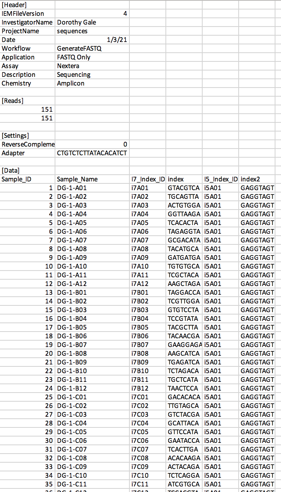

# <span style="color:mediumblue">SampleSheet.py</span>

Create an Illumina® Sample Sheet, the comma-separated text document required by Illumina® sequencing systems to specify (1) sequencing parameters and (2) sample-barcode relationships. Customize [Header], [Reads], and [Data] sections; in particular, draw on up to 192 8-bp barcodes (96x i7 &amp; 96x i5 indices) to specify up to 9,216 sample-barcode relationships for multiplexed amplicon sequencing.
 <br/><br/> 
 
## <span style="color:mediumblue">Table of contents</span>
* [Background](#background)  
* [Features](#features)  
* [Requirements](#requirements)  
* [Synopsis](#synopsis)  
* [System setup](#system-setup)  
	* [Option 1: Virtual machine](#virtual-machine)    
	* [Option 2: Direct install](#direct-install)    
		* [2.1 Python 3 setup](#21-python-3-setup)  
			* [Python 3 (required)](#python-3-required)  
			* [Anaconda (Optional: Python 3 with Jupyter Notebook in one)](#anaconda-optional-python-3-with-jupyter-notebook-in-one)  
				* [Anaconda on Mac](#anaconda-on-mac)  
				* [Anaconda on Linux](#anaconda-on-linux)  
				* [Anaconda on Windows](#anaconda-on-windows)  
			* [Jupyter Notebook (optional)](#jupyter-notebook-optional)  
		* [2.2 GitHub repository](#22-github-repository)  
		* [2.3 Python 3 libraries](#23-python-3-libraries)  
			* [Libraries in default python](#libraries-in-default-python)  
			* [Libraries in virtual python environment](#libraries-in-virtual-python-environment)  
		* [2.4 External dependencies](#24-external-dependencies)
* [Code launch notes](#code-launch-notes)  
	* [Launching .py program](#launching-py-program)
		* [Command line .py](#command-line-py)
		* [Command line .py in virtual environment](#command-line-py-in-virtual-environment)
	* [Launching .ipynb program](#launching-ipynb-program)
		* [Jupyter Notebook .ipynb](#jupyter-notebook-ipynb)
		* [Jupyter Notebook .ipynb in virtual environment](#jupyter-notebook-ipynb-in-virtual-environment)
* [Operation notes](#operation-notes)  
* [Input notes](#input-notes)  
* [Output notes](#output-notes)  
* [Visual summary of key script operations](#visual-summary-of-key-script-operations)  
* [Status](#status)  
* [Contact](#contact)  
  

## <span style="color:mediumblue">Background</span>
  
Sequencing by synthesis (SBS) collects millions to billions of DNA sequence reads *en masse*. DNA templates from tens to thousands of independent sample sources can be barcoded, pooled, and sequenced on a common flow cell. Unique indices (barcode sequences) allow pooled reads to be assigned to cognate sample sources (demultiplexed).  
<br/><br/>

**This script automates creation of an Illumina® Sample Sheet, the comma-separated text document required by Illumina® sequencing systems to specify (1) sequencing parameters and (2) sample-barcode relationships.** With this script, a Sample Sheet with up to 9,216 sample-barcode relationships can be automatically generated in <1 second, following user entry of a single simplified list containing up to 96 sample prefixes assigned to an i7 index range and unique i5 index (each sample prefix to be expanded to up to 96 individual samples, suffixed by well ID (*i.e.*, A01-H12) of a 96-well plate).


## <span style="color:mediumblue">Features</span>
* Automates data entry into 3 Illumina® Sample Sheet sections, based on command-line input provided by a user:
	* \[Header] (InvestigatorName, ProjectName)
	* \[Reads] (# of reads)
	* \[Data] (Sample ID, i7 index, i5 index)

## <span style="color:mediumblue">Requirements</span>
* Python 3.7 or higher - instructions for install below
* Python library for command line script (suggested) PrettyTable - instructions for install below

  
## <span style="color:mediumblue">Synopsis</span>
**This script returns a Sample Sheet file compatible with Illumina® sequencing platforms.** 

**Users are asked for the path to an output directory in which a Sample Sheet will be created, along with user-specific variables for Sample Sheet \[Header\], \[Reads\], and \[Data\] sections.**

**For [Data] relationships between sample names and i7+i5 indices, SampleSheet.py draws upon a set of 192 custom primers with unique 8-bp barcodes compatible with Illumina® sequencing platforms; these indices allow up to 9,216 samples to be arrayed in 96-well (or 384-well) format with unique barcodes for pooled sequencing.**

>(see '[Input notes](#input-notes)' for details).
    
Note on index usage: In this script, each i7 index identifies an individual well within a 96-well plate format (each well is uniquely barcoded by a single i7 index), whereas a single i5 index defines all wells of a specific plate (up to 96 wells in a single plate are barcoded by a common i5 index).  Primer sequences (and indices used by SampleSheet.py) can be found in associated files, i7\_barcode\_primers.xls and i5\_barcode\_primers.xls.

For further usage details, please refer to the following manuscript:  
>*Ehmsen, Knuesel, Martinez, Asahina, Aridomi, Yamamoto (2021)*
    
Please cite usage as:  
>SampleSheet.py  
>*Ehmsen, Knuesel, Martinez, Asahina, Aridomi, Yamamoto (2021)*


## <span style="color:mediumblue">System setup</span>   

### <span style="color:dodgerblue">Virtual machine<span>   
---
#### <span style="color:dodgerblue">Alleles\_and\_altered\_motifs.ova</span>   

The programs are available for use either individually or packaged into a virtual machine which can be run on Mac, Linux, or Windows operating systems. The "Alleles_and_altered_motifs" virtual machine comes pre-installed with BLAST, MEME, the full hg38 genome BLAST database, test datasets, and all the external dependencies needed to run SampleSheet, CollatedMotifs, and Genotypes. Windows users are encouraged to use the virtual machine to run CollatedMotifs because the MEME suite software upon which CollatedMotifs relies is not natively supported on Windows OS.

* Detailed instuctions on Virtual machine download and setup at <a href="https://doi.org/10.5281/zenodo.3406861">Download Alleles\_and\_altered\_motifs virtual machine</a> from Zenodo,  DOI 10.5281/zenodo.3406861

* Note: Running the virtual machine requires virtualization software, such as Oracle VM VirtualBox, available for download at <a href="https://www.virtualbox.org/">Download virtualbox Software</a> https://www.virtualbox.org/


Linux and Mac users can also follow the steps below to install SampleSheet, Genotypes, and CollatedMotifs. If you are running Windows, you can follow the steps below to install SampleSheet and Genotypes (without CollatedMotifs).


### <span style="color:dodgerblue">Direct install<span>  
---
#### <span style="color:dodgerblue">2.1. Python 3 setup</span>

<span style="color:dodgerblue"> First confirm that Python 3 (required) and Jupyter Notebook (optional) are available on your system, or download & install by following the steps below</span>   


Mac and Linux OS generally come with Python pre-installed, but Windows OS does not.  Check on your system for the availability of Python version 3.7 or higher by following guidelines below:  
 
- First open a console in Terminal (Mac/Linux OS) or PowerShell (Windows OS), to access the command line interface.  
 
-  Check to see which version of Python your OS counts as default by issuing the following command (here, `$` refers to your command-line prompt and is not a character to be typed):  
     
	`$ python --version` 
	 
 	- If the output reads `Python 3.7.3` or any version >=3.7, you are good to go and can proceed to [Jupyter Notebook (optional)](#jupyter-notebook-optional).  
 
 	- If the output reads `Python 2.7.10` or anything below Python 3, this signifies that a Python version <3 is the default version, and you will need to check whether a Python version >=3.7 is available on your system.  
 		- To check whether a Python version >=3.7 is available on your system, issue the following command:  
 
 			`$ python3 --version`  
 
 		- If the output finds a Python version >=3.7 (such as `Python 3.7.3`), you are good to go and can proceed to [Jupyter Notebook (optional)](#jupyter-notebook-optional).
		- If the output does *not* find a Python version >3.7, use one of the following two options to download and install Python version >=3.7 on your computer:  

##### <span style="color:dodgerblue">Python 3 (required)</span>
Option 1) Install Python 3 prior to Jupyter Notebook **This option is recommended for most users**   
   
* Go to the following website to download and install [Python](https://www.python.org/downloads/) https://www.python.org/downloads/  
	* Select "Download the latest version for X", and then follow installation guidelines and prompts when you double-click the downloaded package to complete installation.  
	* Once you have downloaded and installed a Python 3 version >=3.7, double-check in your command-line that Python 3 can be found on your system by issuing the following command:  
 	
 		`$ python3 --version` 
 		
	* The output should signify the Python version you just installed.  Proceed to [Jupyter Notebook (optional)](#jupyter-notebook-optional).


##### <span style="color:dodgerblue">Anaconda (Optional: Python 3 with Jupyter Notebook in one)</span>
 
Option 2) Install Python 3 and Jupyter Notebook (together as part of Anaconda package)   
   
* Note, this method has *only been tested for use of SampleSheet.py and Genotypes.py on Windows* and may not work on all Mac or Linux systems in conjunction with the use of Python Virtual Environments (virtualenv) to run CollatedMotifs.py**  
   
* [Anaconda (with Jupyter Notebook) Download & Installation](https://jupyter.readthedocs.io/en/latest/install/notebook-classic.html) https://jupyter.readthedocs.io/en/latest/install/notebook-classic.html
	* Download Anaconda with Python 3, and then follow installation guidelines and prompts when you double-click the downloaded package to complete installation.  

 
###### <span style="color:dodgerblue">Anaconda on Mac</span>
Anaconda with Jupyter Notebook on Mac    

* Anaconda with Jupyter Notebook installed on a Mac/Linux OS will install the “Anaconda-Navigator” application in Applications folder. Within the Anaconda-Navigator application, the user will find:

	>Jupyter Notebook  


* Jupyter Notebook can be launched by clicking the "Launch" icon from within the Anaconda-Navigator
  			- Alternatively, Jupyter Notebook can be launched in terminal by one of the following commands: `$ jupyter notebook` or `$ jupyter-notebook` (version/system specific) to open Jupyter Notebook through a selected internet browser (Google Chrome and FireFox have been tested)
 			
###### <span style="color:dodgerblue">Anaconda on Linux</span>
Anaconda with Jupyter Notebook on Linux   

* To install Anaconda on Linux, open terminal and navigate to the folder where Anaconda script (for example Anaconda3-2020.11-Linux-x86_64.sh) was downloaded.  
	* Change the permissions to allow script execution with the chmod +x command for example:
  	`$ chmod +x Anaconda3-2020.11-Linux-x86_64.sh` 
	* Open the shell script with the ./ command for example:
  	`$ ./Anaconda3-2020.11-Linux-x86_64.sh`
	* Follow the on-screen prompts and answer "yes" to "Do you wish the installer to initialize Anaconda3 by running conda init? [yes|no]"  
	* When the install is finished, restart terminal to initiate the new settings
	* Anaconda navigator can be opened by the following command in a new terminal
  	`$ anaconda-navigator`
	* Jupyter Notebook can be opened through a selected internet browser (Google Chrome and FireFox have been tested) by selecting "Launch" on the Jupyter Notebook icon from within the home screen of the Anaconda Navigator. Note: (base) may appear at the far left of the terminal when Anaconda is activated
	* To deactivate Anaconda and revert to your default Python settings, run the following terminal command:
  	`$ conda deactivate` 
	* To reactivate Anaconda and allow use of anaconda-navigator, run the following terminal command:
   	`$ conda activate`
   	(base) altered@tfbs:~$ conda deactivate\
	* The version of Python and Jupyter Notebook used by your system will be determined by these commands. For example:

						(base) $ conda deactivate
						$ which python
						/usr/bin/python
						$ which jupyter-notebook
						/usr/bin/jupyter-notebook						
						
						$ conda activate
						(base) $ which python
						/home/altered/anaconda3/bin/python
						(base) $ which jupyter-notebook
						/home/altered/anaconda3/bin/jupyter-notebook

	* If you wish to open new default terminals with Anaconda deactivated, add the `$ conda deactivate` command after the conda init code in your .bashrc file and use the `$ conda activate` command prior to use of the `$ anaconda-navigator` when opening Jupyter Notebooks  
	
###### <span style="color:dodgerblue">Anaconda on Windows</span>

Anaconda with Jupyter Notebook on Windows for use with SampleSheet.py and Genotypes.py only:
  			
* Anaconda with Jupyter Notebook installed on a Windows OS will make a separate “Anaconda3 (64 bit)” folder available through the start menu, and is kept separate from any other version of Python or Jupyter Notebook on your system. In the Anaconda 3 (64 bit) folder, the user will find:

>Anaconda PowerShell Prompt (Anaconda 3)     
>Jupyter Notebook (Anaconda 3)   
   
Jupyter Notebook can be run through Anaconda in Windows by opening the “Jupyter Notebook (Anaconda 3)” program from the start menu or from within the Anaconda PowerShell (Anaconda 3) program by one of the following commands: `$ jupyter notebook` or `$ jupyter-notebook` (version/system specific) to open Jupyter Notebook through a selected internet browser (Google Chrome and FireFox have been tested, Internet Explorer and Microsoft Edge should also be compatible)   
   
			
#### <span style="color:dodgerblue">Jupyter Notebook (optional)<span>
*Note, these steps are not required for running the command line SampleSheet.py, but are necessary to run the browser-based Jupyter Notebook SampleSheet.ipynb*.  

- Jupyter Notebook is *not* generally pre-installed on Mac/Linux OS.  To check whether Jupyter Notebook is available with Python 3 on your machine, issue the following command:   

	`$ which jupyter-notebook` (Mac/Linux OS)  
	`$ where.exe jupyter-notebook` (Windows PowerShell)   
   
- If the output indicates that 'jupyter' is available in the path of your Python 3 installation (such as, `/Library/Frameworks/Python.framework/Versions/3.7/bin/jupyter`), you are good to go and can proceed to **Download the SampleSheet repository (or program subset) from GitHub**.  If instead you see an error message indicating that 'jupyter notebook' is not available, issue the following commands using the Python program installer (pip) to install Jupyter:  
  
 	`$ pip3 install --upgrade pip`  
	`$ pip3 install jupyter`  
	
**Confirming Jupyter Notebook**   
  			
 - Users can check Jupyter Notebook locations the terminal (Mac/Linux OS) or Anaconda PowerShell Prompt (Windows OS) by issuing the following command:  
	`$ which jupyter-notebook` (Mac/Linux OS)  
	`$ where.exe jupyter-notebook` (Windows PowerShell)  
	
- If the output indicates that 'jupyter' is available in the path of your Python 3 installation (such as, `/Library/Frameworks/Python.framework/Versions/3.7/bin/jupyter-notebook` (Mac/Linux OS) or `C:\Users\[user]\AppData\Local\Programs\Python\Python37\Scripts\jupyter-notebook.exe` (Windows PowerShell)), you are good to go and can proceed to **Download the SampleSheet repository (or program subset) from GitHub**.  


<br> 


#### <span style="color:dodgerblue">2.2. GitHub repository</span>

Download the SampleSheet repository (or program file subset) from GitHub

SampleSheet.py can be accessed as a **Jupyter Notebook** or **Python program file** available at [YamamotoLabUCSF GitHub](https://github.com/YamamotoLabUCSF/SampleSheet) (https://github.com/YamamotoLabUCSF/SampleSheet).  Please note that access to the file through GitHub requires a personal GitHub account.  

* (a) **Create a personal GitHub account** (free)  
	* follow instructions available at [WikiHow: How to Create an Account on GitHub](https://www.wikihow.com/Create-an-Account-on-GitHub) https://www.wikihow.com/Create-an-Account-on-GitHub. 

* (b) **Navigate to the code repository for SampleSheet**
	* The code repository contains:
		* the **Jupyter Notebook** file (.ipynb)
		* the **Python program** file (.py)
		* **image files** associated with the Jupyter Notebook
		* a **requirements** file (SampleSheet_requirements.txt), used to install all Python dependencies and/or in the creation of a Python virtual environment to run SampleSheet (see **[2.3 Python 3 libraries](#23-python-3-libraries)**, below)
		
* (c) **Download** or **clone** the repository to your personal computer:  

	**Download:**   
	* first click on the repository name to access the repository
	* then download the entire repository directory and its associated subdirectories and files (**green download icon, labeled "Code"**)
	* alternatively, download only the target files you need for your intended purposes 
	  * for example, download the **Jupyter Notebook** file (.ipynb), **image files directory**, and **requirements** file if you plan to use only the Jupyter Notebook

	**Clone:**   
	  
	* first click on the repository name to access the repository
	* then click on the right-hand arrow of the **green download icon, labeled "Code"**, to access the drop-down menu with **Clone** options (HTTPS or GitHub CLI).
	* If selecting the HTTPS option, copy the indicated URL and paste it at your command-line as an argument to the command 'git clone':  
	`$ git clone https://github.com/YamamotoLabUCSF/SampleSheet.git` 

* (d) **Choose a directory location** on your machine where you would like to store the downloaded or cloned repository and its files.  This can be any folder/directory location you like.  **Move the repository files from the directory into which they were downloaded or cloned, into this directory**, if you have not already downloaded or cloned the repository/files directly into your target directory.  

	*Example using command line code*  
	*(directory can be created and accessed using command line prompts)*   
	* For example, on Mac OS:  
	
		* To create an empty directory named 'SampleSheetCode', in the 'Documents' directory:*  
	`$ mkdir /Users/yourusername/Documents/SampleSheetCode`
		* To navigate to the directory named 'SampleSheetCode':	`$ cd /Users/yourusername/Documents/SampleSheetCode`

	* For example, on Windows PowerShell:  
	 
		* To create an empty directory named 'SampleSheetCode', in the 'Documents' directory:  
	`$ mkdir ~/Documents/SampleSheetCode`
		* To navigate to the directory named 'SampleSheetCode':  
	`$ cd ~/Documents/SampleSheetCode`

* (e) Transfer the SampleSheet repository files to this directory you've created and named
* (f) Navigate to the **SampleSheet** repository in the command line
 
<br>
 
#### <span style="color:dodgerblue">2.3. Python 3 Libraries</span>

Python 3 Libraries (required) and virtual environment (optional)

You are now ready to install an **additional Python module** that SampleSheet.py requires for operation.  This Python module can be installed using one of the following two options:

* Option A) Use the pip3 command to automatically download the required library from the Python Package Index repository ([PyPI](https://pypi.org/)) (https://pypi.org/), and install it into your primary Python 3 directory from the requirements file 'SampleSheet_requirements.txt'. This method is the most simple to execute and will be outlined first.

* Option B) Install a Python **virtual environment** (self-contained 'directory' with all the Python modules needed to run SampleSheet.py). This method retains your original Python 3 installation unchanged, protecting it from any possible library version conflicts that may arise from installing or updating the SampleSheet.py required libraries.  
  
##### <span style="color:dodgerblue">Libraries in default Python</span>  
  
**Option A) Direct Python 3 library install**

1. Install the Python module required by SampleSheet.py, using the requirements file named **SampleSheet_requirements.txt**, located in the SampleSheet repository:
	   
	`$ pip3 install -r SampleSheet_requirements.txt`  
	
	pip3 (Mac/Linux OS) is Python 3's installation manager, and as long as there is an internet connection available, pip3 will access the specified module from PyPI and install it for access by Python 3.
	
2. To check that the required SampleSheet.py Python module was installed properly, now issue the follow command:
	
	`$ pip3 list | grep -E 'prettytable'`
	
	If the library install was a success, the output will read the following (note the package version numbers may differ, but all packages should be listed):
	  
  |**Package**|    **Version**|    
  |:--|:--|
  |prettytable|  0.7.2| 


##### <span style="color:dodgerblue">Libraries in virtual python environment</span>

**Option B) Python 3 library install via a virtual environment**

1.  First, install the Python module **virtualenv** ([virtualenv](https://pypi.org/project/virtualenv/)) (https://pypi.org/project/virtualenv/), by issuing the following command at the command line: 
 
	`$ pip3 install virtualenv`  (Mac/Linux OS)  
	
	pip3 is Python 3's installation manager, and as long as there is an internet connection available, pip3 will access the specified module from PyPI (here, virtualenv) and install it for access by Python 3.

2. Next, choose a **directory location** on your machine where you would like to install the files associated with a virtual environment.  This can be any folder/directory location you like (for example, you may have a favorite directory where other Python virtual environments are stored).  Alternatively, simply create the Python virtual environment in the SampleSheetCode directory you created above (in section 2.2.d).  At the command line, navigate to the location of this directory.
	* For example:
		* To navigate to the directory named 'SampleSheetCode':  
		`$ cd ~/Documents/SampleSheetCode`

3. With this directory set as your working location in the command line, now issue the following commands to **create a virtual environment**:  
	
	(a) Create a Python virtual environment named **SampleSheet_env**, specifying that the environment will use Python 3:  
	`virtualenv -p python3 SampleSheet_env` 
	
	(b) Activate SampleSheet_env:   
	`source SampleSheet_env/bin/activate` (Mac/Linux OS)  
	or  
	`$ .\SampleSheet_env\Scripts\activate` (Windows PowerShell)   
			
	(c) You should now see that your command line prompt has changed to indicate that you are in the virtual environment, displaying something along the lines of:  
	`(SampleSheet_env) $`
	
	(d) Now install the Python module required by SampleSheet.py, using the requirements file named **SampleSheet_requirements.txt**, located in the SampleSheet repository:
	   
	`$ pip3 install -r SampleSheet_requirements.txt`  
	
	(e) To check that the required SampleSheet.py Python module was installed properly, now issue the follow command:
	
	`$ pip3 list`
	
	If the virtual environment was set up successfully, the output will read the following (note the package version numbers may differ, but all packages should be listed):	  
	  
  |**Package**|    **Version**|    
  |:--|:--|
  |prettytable|  0.7.2| 


4. Finally, Jupyter Notebook needs to be made aware of the Python virtual environment you just created.  To accomplish this, issue the following commands:  

	(Mac/Linux OS)   
	```$ pip3 install ipykernel```   
	```$ python -m ipykernel install --name=SampleSheet_env```  
note, administrator privileges may be needed on your system, in which case use the following command  
	```$ pseudo python -m ipykernel install --name=SampleSheet_env```  
followed by your administrator password


    (Windows PowerShell)   
	```$ pip3 install ipykernel```   
	```$ python -m ipykernel install --user --name SampleSheet\_env``` 

*  You should now be ready to **access SampleSheet.ipynb** in Jupyter Notebook or at the command line!

*  Just for completeness, to **exit the Python virtual environment and return to your 'native' (default) environment**, simply issue the following command at the command line:

	``$ deactivate`` 
	
	To **re-enter the virtual environment** at any time in the future, you would use the command in 3b:
	
	`$ source SampleSheet_env/bin/activate`  (Mac/Linux OS)  
	or  
	`$ .\SampleSheet\_env\Scripts\activate`  (Windows PowerShell) 

* Also, note that if you'd like **to remove the SampleSheet_env at any time**, you can do so by issuing the following command:  

	`$ rm -rf SampleSheet_env`  (Mac/Linux OS)  
	or  
	`$ rm SampleSheet_env -r -fo`  (Windows PowerShell)  
	
	This would delete the virtual environment from your machine.
<br>  

#### <span style="color:dodgerblue">2.4 External dependencies</span>  

*There are no external dependencies for SampleSheet*  
  
<br>  

## <span style="color:mediumblue">Code launch notes</span>  
   
Code is available as a Jupyter Notebook file (**SampleSheet.ipynb**) or as a Python program file (**SampleSheet.py**) for direct use, or pre-packaged with all dependencies as an Open Virtualization Format file for virtual machines (**Alleles\_and\_altered\_motifs.ova**).  

### <span style="color:dodgerblue">Python program (SampleSheet.py) or Jupyter Notebook (SampleSheet.ipynb)</span>

In [System setup](#system-setup) above, you downloaded and installed Python 3 & the SampleSheet code repository.  Optionally, you may have also installed Jupyter Notebook & created a Python virtual environment (SampleSheet\_env) containing the Python modules that SampleSheet.py needs in order to run.  To access SampleSheet.py (Jupyter Notebook or Python program file) for interactive work, proceed through guidelines indicated below.  


#### <span style="color:dodgerblue">Launching .py program</span>
##### <span style="color:dodgerblue">Command line .py</span>


* To start the SampleSheet.py program directly from the command line, enter the follwing command:

	`$ python3 [path_to_SampleSheet.py]/SampleSheet.py`

* For example, if you installed SampleSheet.py within the SampleSheetCode folder on your desktop, the command would be:

	`$ python3 ~/Desktop/SampleSheetCode/SampleSheet.py`

*  If these steps have been accomplished successfully, you will now encounter the first interactive prompts of SampleSheet.py.  Be prepared to provide required input variables as detailed below in **[Input Notes](#input-notes)**.

##### <span style="color:dodgerblue">Command line .py in virtual environment</span>

1.  If you plan to run SampleSheet.py using the SampleSheet_env Python3 virtual environment from your command line, first navigate to the directory containing **SampleSheet.py**.  Prepare access to a Python virtual environment containing appropriate packages required by SampleSheet.py, as described in [System setup](#system-setup).  

    (a) Activate SampleSheet_env:   
	`$ source SampleSheet_env/bin/activate` (Mac/Linux OS)   
	`$ .\SampleSheet_env\Scripts\activate` (Windows PowerShell)   
		
	(b) You should now see that your command line prompt has changed to indicate that you are in the virtual environment, displaying something along the lines of:  
	`(SampleSheet_env) $`   

2.  To run SampleSheet.py, type **python3 SampleSheet.py** and hit 'Enter':   
	`(SampleSheet_env) $ python3 SampleSheet.py`   
	
3.  If these steps have been accomplished successfully, you will now encounter the first interactive prompts of SampleSheet.py.  Be prepared to provide required input variables as detailed below in **[Input Notes](#input-notes)**.   


#### <span style="color:dodgerblue">Launching .ipynb program</span>   
##### <span style="color:dodgerblue">Jupyter Notebook .ipynb</span>  

Note, Jupyter Notebook file requires SampleSheet_img directory containing five image files to be available in the directory from which the Jupyter Notebook will be opened.   

1. To start Jupyter Notebook directly from the command line, enter the following command:   

	`$ jupyter notebook` or alternatively `$ jupyter-notebook`   

2. You will see a new **tab open automatically in your default web browser** (such as Chrome), in which there is a **directory tree** illustrating the current file contents of the **current working** directory.  Navigate to the directory containing **SampleSheet.ipynb**.  Click on the **SampleSheet.ipynb** file to open it as a Jupyter Notebook.   


##### <span style="color:dodgerblue">Jupyter Notebook .ipynb in virtual environment</span> 
 

*Note*, Jupyter Notebook file requires *SampleSheet_img* directory containing five image files to be available in the directory from which the Jupyter Notebook will be opened.   

1.  If you downloaded **Anaconda (with Jupyter Notebook)**, launch the Anaconda-Navigator application.  Click on **Jupyter Notebook** to activate Jupyter Notebook. Otherwise, open Jupyter Notebook with the terminal command `$ jupyter notebook` or `$ jupyter-notebook`  

2.  You will see a new **tab open automatically in your default web browser** (such as Chrome), in which there is a **directory tree** illustrating the current file contents of the **current working** directory.  Navigate to the directory containing **SampleSheet.ipynb**.  Click on the **SampleSheet.ipynb** file to open it as a Jupyter Notebook.   

3. In the Jupyter Notebook menu bar at the top of the newly opened SampleSheet.py Jupyter Notebook file, take the following steps to **specify SampleSheet\_env as your Python virtual environment** (see [System setup](#system-setup): 3. Create a Python Virtual Environment for Jupyter Notebook):    

	(a) click on the **'Kernel'** tab to open a drop-down menu  
	(b) hover your mouse over **'Change Kernel'** (bottom option of drop-down menu) to identify the kernels available to the Notebook  
	(c) choose **SampleSheet\_env** as the kernel  
	 
	 If SampleSheet\_env does not appear as a kernel option, troubleshooting is needed to either create the SampleSheet\_env virtual environment, or to make Jupyter Notebook aware of the existence of the SampleSheet_env virtual environment.

4.  If these steps have been accomplished successfully, you are now ready to use the SampleSheet.ipynb Jupyter Notebook.  Be prepared to provide required input variables as detailed below in **[Input Notes](#input-notes)**.
<br>


## <span style="color:mediumblue">Operation notes</span>
*What does this script do?*

This script automates creation of a Sample Sheet compatible with Illumina® sequencing, based on custom i7 (96) and i5 (96) index sequences used to barcode up to 9,216 distinct samples. Specifically, the script performs these operations:

 1. **collect user input**
    - specify Dual Indexed Sequencing Workflow (A *vs.* B)
    - specify Investigator Name, Project Name
    - specify single index (SE) *vs.* dual-indexed (PE) barcode format
    - collect Data relationships (sample ID, i7 barcode range (1-96) and single i5 barcode (1-96)  
 
 
 2. **generate Sample Sheet**
    - populate \[Header\] and \[Reads\] sections based on user input for Investigator Name, Project Name, SE/PE format
    - populate \[Data\] section based on expansion of i7 barcode range and i5 barcode designation for each 96-well plate  
    (appropriate i7 and i5 index sequences are populated based on user-specified Workflow (A *vs.* B))

## <span style="color:mediumblue">Input notes</span>
You will be prompted for the following user-specific information:

**Required** (4 strings):
      <ul>
      <li>where should output file go?</li>
          *absolute path to* **output directory** *and filename for Sample Sheet*
      <li>Investigator Name</li>
          *character string specifying name to be associated with Sample Sheet and sequencing run*         
      <li>Project Name</li>
          *character string specifying project name to be associated with Sample Sheet and sequencing run*
      <li>Run type specification: Single-end (SE) or Paired-end (PE) sequencing run?  
      *how many sequencing cycles (read length for R1 (Read 1) and R2 (Read 2))?*  
      *...comma-separated character string indicating SE vs. PE, # of sequencing cycles (R1), # of sequencing cycles (R2, if applicable)*
      <li>List of sample:barcode relationships</li>
      *single lines of comma-separated character strings specifying overarching sample prefix to assign to up to 96 samples arrayed in 96-well plate format (prefix is parsed to samples with well suffixes, e.g., -A01, -A02...-H12); barcode assignments (i7 and i5) are designated to individual samples based on integer range (i7) or integer (i5) assigned to plate*
      </ul>
  
Note on list of sample:barcode relationships: This is a list of plate names (prefixes), i7 index range, and i5 index.  
For example: 'DG-1, 1-96, 5' on a single line of text would indicate plate name/prefix 'DG-1' applied to up to 96 samples (uniqued identified by well position A01-H12, *e.g.*, DG-1-A01, DG-1-A02, ... DG-1-H12), range of i7 indices used to barcode individual wells in this 96-well plate (*e.g.*, A01-H12), and i5 index used across all wells of this plate (*e.g.*, A05).

## <span style="color:mediumblue">Output notes</span>
In brief: Illumina® Sample Sheets accommodate up to 10 column fields, but only 5 of these (fields 2, 5-8) are required for a sequencing run (indicated below).  This script outputs only these 5 required column fields.  
 
10 Sample Sheet column fields:  
  - field 1: Sample\_ID,  
  - field 2: Sample\_Name,  
  - field 3: Sample\_Plate,  
  - field 4: Sample\_Well,  
  - field 5: I7\_Index\_ID, 
  - field 6: index,  
  - field 7: I5\_Index\_ID,  
  - field 8: index2, 
  - field 9: Sample\_Project,  
  - field 10: Description  

Fields customized and output by this script:  
  - field 2: Sample_Name,  
  - field 5: I7\_Index\_ID, 
  - field 6: I7 index sequence,  
  - field 7: I5\_Index\_ID,  
  - field 8: I5 index sequence  
 
## <span style="color:mediumblue">Visual summary of key script operations</span>
In short, **brief user inputs** (*e.g.*, below), are converted to **Sample Sheet** contents compatible with Illumina® sequencing (**key output file**, below). In particular, a minimal list of up to 96 \[Data\] relationships is expanded in microseconds to a \[Data\] section containing up to 9,216 sample:barcode relationships.  

*example*  

------
**input:**  
*Path to Sample Sheet file name for creation:* /Users/name/SampleSheet.csv  
*Workflow:* A  
*Investigator Name, Project Name*: Dorothy Gale, sequences  
*SE vs. PE, cycle details*: PE, 151, 151  
*sample:barcoded relationships:*    
DG-1, 1-96, 1  
DG-2, 1-96, 9  
DG-3, 1-50, 78  
DG-4, 1-68, 34  
<br clear="all" />
**output:**
<br clear="all" />
  
<div style=text-align:center>...etc.</div>


## <span style="color:mediumblue">Status</span>
Project is:  _finished_, _open for further contributions_


## <span style="color:mediumblue">Contact</span>
Created by kirk.ehmsen[at]gmail.com - feel free to contact me!    
Keith Yamamoto laboratory, UCSF, San Francisco, CA.
